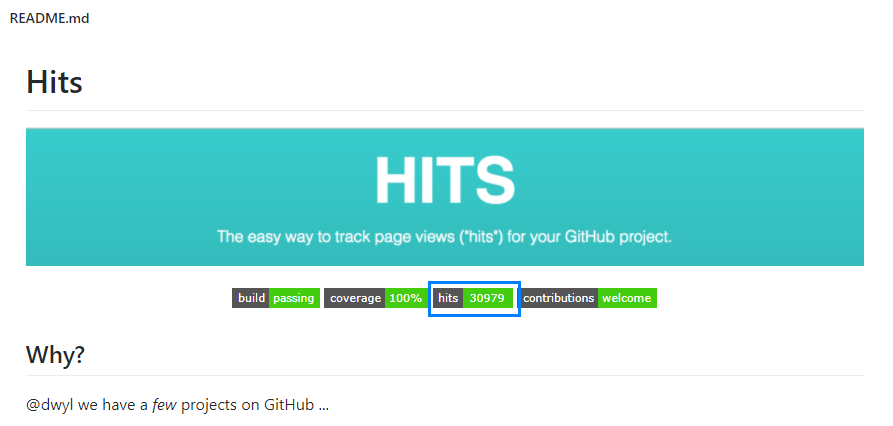

# 방문자에게 게시글 조회수 보여주는법

Jekyll과 같은 정적 블로그는 간편한 것이 장점입니다. 하지만 DB가 없기 때문에 누적 방문자 수를 체크하기가 어렵다는 단점이 있습니다.

이것을 해결하기 위해서는 써드파티 앱인 **[HITS](https://github.com/dwyl/hits)**를 사용하면 간단하게 해결가능합니다.

 **[HITS](https://github.com/dwyl/hits)**는 github repository에 방문하는 사람들을 세기 위한 프로젝트로 만들어졌다고 합니다. 

