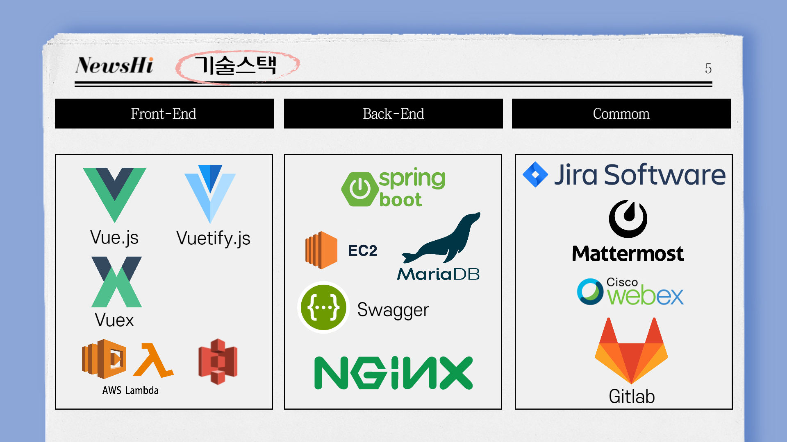

---
## [Information]

- Email: sung9gi@gmail.com
- Phone: +82-10-7120-7156
- Blog: [Blog link](https://likelionSungGuk.github.io)
- github: [Github link](https://github.com/likelionSungGuk/) 

## [Objectives]

> 꾸준히 성장하는 개발자 조성국입니다.

## [Experiences & Educations]

#### SAMSUNG SOFTWARE ACADEMY FOR YOUTH 삼성청년소프트웨어 아카데미

> 2020.07 ~ present

#### 교육내용

- Language: Python, javascript
- Framework: Vuejs
- Algorithms
- Projects

#### In-datalab (주)인데이터랩 

> 2017.07 ~ 2019. 03

#### Role 1. Project Manager

- [모두의 Q&A] 라는 모바일 어플리케이션 개발 project managing 업무를 맡아 android, 서버, 디자이너와 협업하여 완성하였습니다. 5만명 이상의 다운로드를 달성하였습니다.

#### Role 2. Marketing Executer

- [모두의 Q&A] 어플리케이션의 marketing을 담당하였습니다. Google Ads, Facebook Ads등을 활용하였고, Facebook page 운영, 오프라인 박람회 부스 운영 등을 진행했습니다.

#### Role 3. Web application developer

- [Pluto]라는 웹 어플리케이션을 개발하였습니다. Ruby on Rails를 활용했으며 Machine Learning으로 학습된 데이터를 받아 웹 상에서 시각화하는 파트를 맡았습니다.

---

## [Skills]

#### Languages

- python
- ruby
- javascript

#### Frameworks

- django
- ruby on rails
- Vuejs

#### ETC

- git & github
- zeplin

## [Projects]

#### 소셜 뉴스 큐레이션 플랫폼 NewsHi (뉴하)

>  2021.1.11 ~ 2021.2.19 (6week)
> 뉴하는 누구나 큐레이터가 될 수 있는 소셜 뉴스 큐레이션 플랫폼입니다.
> 원하는 큐레이터를 선택하면 큐레이터가 공유하는 기사목록들과 왜 이 뉴스를 추천하고 꼭 봐야하는지에 대한 의견도 확인할 수 있습니다. 또한 빠르게 해당 내용을 확인할 수 있는 기사 요약 기능도 제공합니다.
> SERVER와 CLIENT를 완벽히 구분하고 REST API를 통해서만 통신하도록 하였습니다.
> 프로젝트에 대한 보다 자세한 설명은 아래 github repository의 README에 상세히 작성하였습니다.

- 목표
  - No스크린샷! No 구글드라이브 공유!
  - URL복사 +붙여넣기만 하면 기사 스크랩 끝!
  - 여러개의 기사도 한 번에 공유할 수 있는 통합 공유링크 생성
  - 지금 나에게 필요한 뉴스를 찾아주는 플랫폼
  - 시간없을 때 알짜배기 기사들만 요약해서 모아 볼 수 있는 플랫폼
  - 기사를 눈으로 읽기 어려운 상황에서 활용할 수 있는 음성으로 읽는 Text To Speech 기능 제공
- github repository: wating...
- intro video: [뉴스하이 소개 영상 (약 5분)](/assets/data/newshi_video.mp4)
- Team member: 5 
  - Back-end: 2
  - Front-end: 3
- 맡은 역할: Front -end
  - Main page
  - 기사 페이지
  - 텍스트 음성 읽기 (Text To Speech)
  - 다크모드 지원
  - 피드백 이메일 보내기 (AWS lambda & AWS SES)
- 기술스택
  - 

#### 영화추천사이트 WATCHUB

> 2020.11.19 ~ 2020.11.26 (1week)
>사용자의 선호도(좋아요 기능), 시청기록(이미 본 영화 기능) 등을 활용해 사용자 맞춤 영화 추천 알고리즘을 구현한 사이트입니다.
> `영화가 모여있는 공간!`이라는 점에서 개발자라면 매일밤 들어가는 `github`의 `hub`를 활용하여 `WATCHUB`라는 서비스명을 짓게 되었습니다.
>SERVER와 CLIENT를 완벽히 구분하고 REST API를 통해서만 통신하도록 하였습니다.
> 프로젝트에 대한 보다 자세한 설명은 아래 Client side repository의 README에 상세히 작성하였습니다.
>Team member: 2

- github repository: 
  - [CLIENT side(Front-end) repository](https://github.com/likelionSungGuk/watchub-front)
- preview: [wathub.mp4](/assets/data/watchub.mp4)
- site link:
  - http://watchub2.s3-website.ap-northeast-2.amazonaws.com/
- Front-end: vanilla javascript, Vuejs framework (vuex, vue router), bootstrap
- Back-end: python, django, sqlite, serializer, REST API
- data: [TMDB API](https://developers.themoviedb.org/3/getting-started/introduction) 
- Authentication: JWT token
- Awards: 최종 프로젝트 결과 발표 우수상 (2nd prize)

#### 자율주행 알고리즘 COMPETITION

> 2020.12.7 ~ 2020.12.29 (4weeks)
>python을 활용하여 실시간으로 MAP의 장애물과 다른 차량을 피해 가장 빨리 완주하는 알고리즘 대회입니다.
> Team member: 2

- github repository: 대회 주최측 요구로 비공개
- 예시 영상: [self driving video](/assets/data/selfdriving.mp4)

#### 한국어 자연어처리 분석 어플리케이션 PLUTO

> 2020.11.19 ~ 2020.11.26 (1week)
>Team member: 5

- github repository: [Pluto](https://github.com/likelionSungGuk/pluto-planb)
- preview: [site link](https://pluto-planb2.herokuapp.com/)
  - id: admin@in-datalab.com
  - pw: indatalab0707
- Front-end: html, css, javascript, bootstrap
- Back-end: ruby, rails
- data: python crawler(bs4, selenium)
- machine learning: python, konlpy
- patent(특허): [사용자 반응 데이터 분석 방법 및 장치](http://kpat.kipris.or.kr/kpat/biblioa.do?method=biblioFrame&start=biblio&searchFg=N)

#### 라즈베리 파이를 이용한 미세먼지 경보 알림 프로젝트 

> 스마트폰을 사용하지 못하는 취약계층에게 미세먼지 농도가 높은 날 경보를 울려 미세먼지에 대응 할 수 있도록 하는 프로젝트
>서울시 공공데이터를 활용하여 매 시간 사용자에게 미세먼지 농도가 위험수준을 넘어서면 알람소리와 불빛으로 경고하여 미세먼지에 대응할 수 있도록 함.
> 라즈베리 파이를 통해 하드웨어로 볼 수 있도록 설계
>Team member: 6

- preview: [port folio](/assets/data/융기프_해커톤포스터.pdf)
- Back-end: python, linux, Raspberry pi

#### 어학원 메타검색 사이트 TOST

>  2015.05. ~ 2015.08.  (3months)
>Y*사, H사, P사 등 영어학원 모든 수업을 모은 메타검색 사이트
>  과목, 레벨, 위치, 요일을 선택해서 영화예매하듯 수업을 고를 수 있습니다.
>Team member: 5    

- github repository: [tost](https://github.com/likelionSungGuk/tost)
- preview:
  - [tost portfolio](/assets/data/토스토tost_포트폴리오.pdf)
  - [site link](http://tostenglish.herokuapp.com/)
- Front-end: html, css, javascript, bootstrap
- Back-end: ruby, rails (nokogiri, mechanise)
- Authentication: gem devise
- Awards: 멋쟁이사자처럼 해커톤 4위 (500-1000명 참가) 